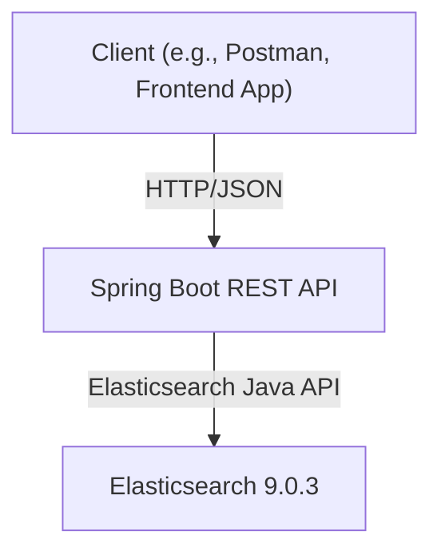

# Multilingual Elasticsearch Search

A Spring Boot REST API for storing and searching multilingual documents using Elasticsearch. This project enables efficient full-text search across multiple languages, making it ideal for applications requiring internationalization and multilingual content management.

## Table of Contents

- [Features](#features)
- [Architecture](#architecture)
- [Requirements](#requirements)
- [Getting Started](#getting-started)
  - [Running with Docker](#running-with-docker)
  - [Manual Setup](#manual-setup)
- [API Documentation](#api-documentation)
  - [Insert Document](#insert-document)
  - [Search Documents](#search-documents)
- [Data Model](#data-model)
- [Configuration](#configuration)
- [Testing](#testing)
- [Troubleshooting](#troubleshooting)
- [License](#license)
- [Author](#author)

---

## Features

- Store documents with content in multiple languages.
- Full-text search across all languages in a single query.
- RESTful API for document management.
- Optimized Elasticsearch index and mapping.
- Dockerized for easy deployment.
- Secure Elasticsearch setup with authentication.

---

## Architecture



---

## Requirements

- Java 17+
- Maven 3.6+
- Docker & Docker Compose (for containerized setup)

---

## Getting Started

### Running with Docker

1. **Clone the repository:**
   ```sh
   git clone https://github.com/ArianKheir/Multilingual-ElasticSearch.git
   cd Multilingual-ElasticSearch
   ```

2. **Start the services:**
   ```sh
   docker compose up --build
   ```
   This will start:
   - Elasticsearch (secured, port `9200`)
   - Spring Boot API (port `8080`)

3. **Access the API:**
   - API base URL: `http://localhost:8080/api/documents`
   - Elasticsearch: `http://localhost:9200` (user: `elastic`, password: see `docker-compose.yaml`)

### Manual Setup

1. **Start Elasticsearch:**
   - Install and run Elasticsearch 9.0.3 locally, or use Docker as above.

2. **Configure environment variables:**
   - Set `SPRING_ELASTICSEARCH_URIS`, `SPRING_ELASTICSEARCH_USERNAME`, and `SPRING_ELASTICSEARCH_PASSWORD` as needed.

3. **Build and run the Spring Boot app:**
   ```sh
   cd multilingual-search
   mvn clean package
   java -jar target/*.jar
   ```

---

## API Documentation

### Insert Document

- **Endpoint:** `POST /api/documents`
- **Description:** Insert a new multilingual document.
- **Request Body:**
  ```json
  {
    "identifier": "doc1",
    "body": {
      "en": "Hello",
      "fa": "سلام"
    }
  }
  ```
- **Response:** `200 OK`
  ```json
  {
    "identifier": "doc1",
    "body": {
      "en": "Hello",
      "fa": "سلام"
    },
    "bodyAll": "Hello سلام"
  }
  ```
- **Errors:**
  - `409 Conflict` if the identifier already exists.

### Search Documents

- **Endpoint:** `GET /api/documents/search?text={query}&size={N}`
- **Description:** Search for documents containing the given text in any language.
- **Parameters:**
  - `text` (required): The search query.
  - `size` (optional): Max number of results (default: 10).
- **Response:** `200 OK`
  ```json
  [
    {
      "identifier": "doc1",
      "body": {
        "en": "Hello",
        "fa": "سلام"
      },
      "bodyAll": "Hello سلام"
    }
    // ... more documents
  ]
  ```

---

## Data Model

A document is represented as:

| Field      | Type              | Description                                 |
|------------|-------------------|---------------------------------------------|
| identifier | string            | Unique document ID                          |
| body       | map[string]string | Language code to text (e.g., "en", "fa")    |
| bodyAll    | string            | Concatenated text for optimized search      |

---

## Configuration

- **Elasticsearch index:** `multilingual_documents`
- **Index mapping:** Ensures `bodyAll` is mapped as `text` for full-text search.
- **Environment variables:**
  - `SPRING_ELASTICSEARCH_URIS`
  - `SPRING_ELASTICSEARCH_USERNAME`
  - `SPRING_ELASTICSEARCH_PASSWORD`

See `docker-compose.yaml` for example values.

---

## Testing

- Unit and integration tests are provided using JUnit and Mockito.
- To run tests:
  ```sh
  cd multilingual-search
  mvn test
  ```

---

## Troubleshooting

- **Elasticsearch connection errors:** Ensure the service is running and credentials match.
- **Port conflicts:** Change the exposed ports in `docker-compose.yaml` if needed.
- **Duplicate document error:** Identifiers must be unique.

---

## License

This project is licensed under the MIT License.

---

## Author

Arian Kheirandish

---

**Contributions are welcome!** For issues or feature requests, please open an issue or submit a pull request. 